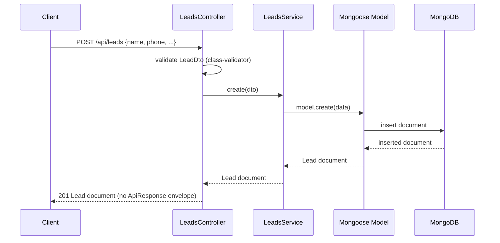

# Backend — Architecture

## Layering

Standard NestJS module/controller/service/schema layering, one module per domain:

```
Controller (HTTP layer, DTO validation via class-validator)
    ↓
Service (business logic, Mongoose model access)
    ↓
Mongoose Schema/Model (persistence)
```

- **Controllers** (`*.controller.ts`) define routes and inline DTO classes decorated with `class-validator`
  decorators (e.g. `LeadDto` in `backend/src/modules/leads/leads.controller.ts`). DTOs are defined in the
  same file as the controller that uses them — there is no separate `dto/` folder convention yet.
- **Services** (`*.service.ts`) hold business logic and are the only layer that touches the Mongoose model
  directly via `@InjectModel`.
- **Schemas** (`*.schema.ts`) use `@nestjs/mongoose` decorators (`@Schema`, `@Prop`) and export both the
  Mongoose schema and a `HydratedDocument` type alias (e.g. `UserDocument`, `LeadDocument`).
- **Modules** (`*.module.ts`) wire `MongooseModule.forFeature(...)`, controllers, providers, and any
  cross-module imports (e.g. `AuthModule` imports `UsersModule` to reuse `UsersService`).

## Cross-cutting setup (`backend/src/main.ts`)

- Global route prefix: `api` (`app.setGlobalPrefix('api')`)
- CORS: open (`origin: true, credentials: true`) — no allow-list
- Global `ValidationPipe` with `whitelist: true, transform: true` — unknown DTO fields are stripped, payloads
  are transformed to DTO instances
- Swagger UI generated at `/docs`, with Bearer auth configured in the `DocumentBuilder` (`addBearerAuth()`)
  — but see **Auth is not enforced** below

## Data flow (example: creating a lead)



## Notable decisions & gaps (inferred from code, not documented elsewhere)

- **Auth is now enforced globally.** `AuthModule` registers a custom `JwtAuthGuard` and `RolesGuard` as
  `APP_GUARD` providers (`backend/src/modules/auth/auth.module.ts`), so every route in the app requires a
  valid Bearer JWT by default — new controllers get this for free without adding `@UseGuards()` themselves.
  Routes opt out individually via `@Public()` (used today only by `auth.register`/`auth.login`). Role
  restriction (`@Roles()` + `RolesGuard`) is wired but not yet applied to any route — see
  `.ai/BE/features/auth.md` Open questions. This doesn't use Passport (`@nestjs/passport`/`passport-jwt`) —
  it's a hand-written guard using the existing `JwtService` directly, to avoid adding a new dependency for a
  single-strategy use case.
- **`register` always creates an `ADMIN` user.** `AuthService.register` hardcodes `role: 'ADMIN'`
  (`backend/src/modules/auth/auth.service.ts`) — the caller cannot self-register as any other role. Seeded
  non-admin accounts only exist via `UsersService`'s startup seeder.
- **No response envelope in use.** `common/contracts/index.ts` defines `ApiResponse<T>` /
  `ApiError` shapes, but controllers return raw Mongoose documents or plain objects (e.g.
  `LeadsController.list` returns `{ data, meta }` matching the shape by convention, but `create`/`status`
  return a bare document) — the contract is aspirational, not enforced by any interceptor or base class.
- **Single fixed organization.** `organizationId` defaults to `'default'` (or `DEFAULT_ORGANIZATION_ID`) at
  the schema level and is hardcoded in `LeadsController.list('default', ...)` rather than being derived from
  an authenticated request — consistent with this being a single-org system, not multi-tenant scaffolding.
- **Idempotent startup seeding.** `UsersService.onModuleInit` (`backend/src/modules/users/users.service.ts`)
  seeds 7 fixed role accounts on every boot unless `SEED_USERS=false`, skipping any email that already
  exists. This doubles as the only way non-admin role accounts get created — there's no admin UI/endpoint to
  create users of other roles.
- **DTOs and validation live in the controller file**, not a separate `dto/` subfolder — this is the
  established pattern (`AuthDto`, `LeadDto`) for any new controller to follow.
