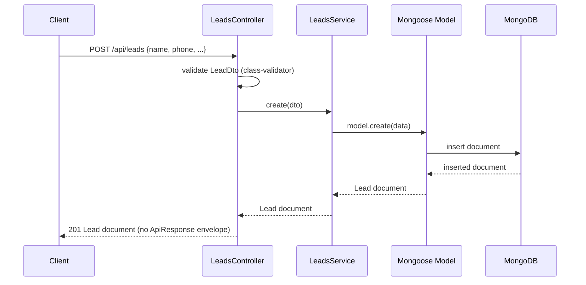

# Backend — Architecture

## Layering

Standard NestJS module/controller/service/schema layering, one module per domain:

```
Controller (HTTP layer, DTO validation via class-validator)
    ↓
Service (business logic, Mongoose model access)
    ↓
Mongoose Schema/Model (persistence)
```

- **Controllers** (`*.controller.ts`) define routes, decorated with both `class-validator` (via the DTOs
  they accept) and `@nestjs/swagger` decorators (`@ApiTags`, `@ApiBearerAuth`, `@ApiOperation`,
  `@ApiResponse`, `@ApiQuery`/`@ApiParam` for query/path params).
- **DTOs** live in a `dto/` subfolder per module (e.g. `backend/src/modules/leads/dto/create-lead.dto.ts`),
  one class per file, formatted normally (one field per line) — **not** the single-dense-line style used
  elsewhere in this codebase. This is a deliberate exception: `@ApiProperty()`/`@ApiPropertyOptional()`
  decorators on every field make the dense style unreadable. Every request DTO field carries both its
  `class-validator` decorator(s) and its `@ApiProperty`; every endpoint has a matching **response** DTO class
  (e.g. `LeadResponseDto`, `LeadListResponseDto`) used purely for Swagger's `type:` option — the controller
  still returns the raw Mongoose document/plain object at runtime, so the response DTO documents the intended
  contract rather than enforcing it (see "No response envelope in use" below). **Standing rule (see project
  memory `feedback_swagger_docs`): every new DTO and endpoint must ship fully Swagger-documented in the same
  change that adds it.**
- **Services** (`*.service.ts`) hold business logic and are the only layer that touches the Mongoose model
  directly via `@InjectModel`.
- **Schemas** (`*.schema.ts`) use `@nestjs/mongoose` decorators (`@Schema`, `@Prop`) and export both the
  Mongoose schema and a `HydratedDocument` type alias (e.g. `UserDocument`, `LeadDocument`).
- **Modules** (`*.module.ts`) wire `MongooseModule.forFeature(...)`, controllers, providers, and any
  cross-module imports (e.g. `AuthModule` imports `UsersModule` to reuse `UsersService`).

## Cross-cutting setup (`backend/src/main.ts`)

- Global route prefix: `api` (`app.setGlobalPrefix('api')`)
- **2026-08-24: `helmet({ contentSecurityPolicy: false })` + `compression()`** added ahead of
  everything else. CSP disabled deliberately — the default policy breaks Swagger UI's inline
  bootstrap script at `/docs`, and buys little for a JSON API whose only HTML surface is that page.
- **CORS is now an env-driven allow-list** (`ALLOWED_ORIGINS`, comma-separated, `'*'` escape hatch;
  default `http://localhost:3000`) — was `origin: true` (wide open) before 2026-08-24.
- Global `ValidationPipe` with `whitelist: true, transform: true` — unknown DTO fields are stripped, payloads
  are transformed to DTO instances
- Swagger UI generated at `/docs` (raw JSON at `/docs-json`), with Bearer auth configured in the
  `DocumentBuilder` (`addBearerAuth()`, default scheme name `bearer`, matched by every controller's
  `@ApiBearerAuth()`). **All 10 endpoints are fully documented** as of 2026-08-08: tags, operation summaries,
  request DTOs, response DTOs (including error-status descriptions), and security requirements. Public
  routes (`auth.register`/`auth.login`) correctly show no security requirement in the generated spec.
- **2026-08-24: `app.enableShutdownHooks()`** added — graceful shutdown on `SIGINT`/`SIGTERM`,
  verified live (clean exit, no hang, Mongoose connection closed).
- **2026-08-24: per-IP rate limiting** (`@nestjs/throttler`, registered as a global `APP_GUARD` in
  `app.module.ts`) — 300 req/min default, 20/min on `auth/register`/`auth/login`. In-memory,
  per-instance storage (documented gap — see `.ai/BE/features/production-hardening.md`).

## Data flow (example: creating a lead)



## Notable decisions & gaps (inferred from code, not documented elsewhere)

- **2026-08-24, fixed: `JWT_SECRET` was silently ignored.** `AuthModule`'s `JwtModule` registration
  used to read `process.env.JWT_SECRET` inside its `@Module()` decorator — decorator evaluation
  happens at `import` time, when `auth.module.ts` is loaded at the top of `app.module.ts`, **before**
  `app.module.ts`'s own body runs `ConfigModule.forRoot()`. So unless `JWT_SECRET` was already in the
  OS-level environment (not just `.env`), every token was silently signed with the hardcoded fallback
  `'dev-secret'`. Fixed via `JwtModule.registerAsync({ inject: [ConfigService], useFactory })`, which
  resolves at Nest's module-instantiation phase instead (after `ConfigModule` has loaded `.env`), and
  now throws at boot if the secret is still missing. **General lesson for this codebase:** any env
  value read inside a `@Module()`/controller decorator argument (as opposed to inside a
  `useFactory`, or at runtime in `main.ts`/a service method) is not safe to assume `.env` has been
  loaded yet — this is why the new throttler's `@Throttle()` limits on `auth.controller.ts` are
  hardcoded literals, not env reads.
- **2026-08-24: health check is hand-rolled (`GET /api/health`), not `@nestjs/terminus`.** Terminus
  pulls peer deps spanning gRPC/Prisma/TypeORM/Sequelize/MikroORM/`@nestjs/axios` for a single check
  this project needs (`Connection.readyState` + `admin().ping()`), and imposes its own response
  envelope/decorator idiom in a repo that already has one convention (hand-documented Swagger, one
  response DTO per route). Revisit when a second dependency (Redis, S3, an external API) needs its
  own health indicator with its own timeout/retry semantics.
- **Auth + authorization are four chained global guards, as of 2026-08-27.** `AuthModule` registers
  `JwtAuthGuard`, `OrganizationStatusGuard` (new), `RolesGuard`, and (2026-08-08) `PermissionsGuard`
  as `APP_GUARD` providers, in that exact order (`backend/src/modules/auth/auth.module.ts`) — order
  matters twice over: `OrganizationStatusGuard`/`PermissionsGuard` both read `request.user`, which
  only `JwtAuthGuard` attaches; and `OrganizationStatusGuard` must run **before**
  `PermissionsGuard`, because `PermissionsGuard` bypasses `SUPERADMIN` unconditionally, and a
  `PENDING` organization's first (and only) user is exactly a `SUPERADMIN` — reversing the order
  would let a pending org's owner through every permission check. Every route requires a valid
  Bearer JWT by default (`JwtAuthGuard`), opt-out via `@Public()`, **and** the caller's organization
  must be `ACTIVE` (`OrganizationStatusGuard`, opt-out via `@Public()` or
  `@AllowInactiveOrganization()` — see `.ai/BE/features/multi-tenancy.md`), **and** a specific
  `(Resource, action)` grant (`PermissionsGuard` + `@RequirePermission()`, dynamic and
  SUPERADMIN-configurable via `GET/PATCH /api/permissions` — see `.ai/BE/features/permissions.md`).
  `RolesGuard`/`@Roles()` are kept but superseded — applied to zero routes, not the real
  authorization mechanism. `JwtAuthGuard` doesn't use Passport (`@nestjs/passport`/`passport-jwt`) —
  it's a hand-written guard using the existing `JwtService` directly, to avoid adding a new
  dependency for a single-strategy use case.
- **Platform routes run a completely separate, parallel guard chain.** `PlatformModule` registers
  its own `JwtModule.registerAsync` bound to `PLATFORM_JWT_SECRET` — a different secret from
  `JWT_SECRET`, so an org token and a platform token are mutually, cryptographically rejected on
  each other's routes (verified live both directions). `PlatformAdminGuard` is applied
  controller-scoped, not globally, via the composite `@PlatformAdminOnly()` decorator (which also
  applies `@Public()` to step the four global guards above aside, and `@ApiBearerAuth()`). See
  `.ai/BE/features/platform-admin.md` for why this is a separate collection/identity rather than a
  `User` with `organizationId: null`.
- **`@CurrentUser()` param decorator** (`backend/src/modules/auth/decorators/current-user.decorator.ts`,
  added 2026-08-27) replaces the ad-hoc `@Req() req: {user:...}` pattern a couple of controllers used
  to use. `@CurrentUser('organizationId')` is now the first parameter on ~35 retrofitted handlers.
  Worth knowing: **custom param decorators (`createParamDecorator`) are invisible to the Swagger
  generator** — adding one to a handler produces zero `@ApiQuery`/`@ApiParam` churn in the generated
  spec, which is why the whole multi-tenancy retrofit didn't need to touch any Swagger decorators.
- **`register` creates a `CUSTOMER` user, not `ADMIN`, and is off by default as of 2026-08-27.**
  `AuthService.register` hardcodes `role: 'CUSTOMER'` (`backend/src/modules/auth/auth.service.ts`) —
  changed 2026-08-08 from an earlier `ADMIN` default, which was an open privilege-escalation gap.
  Once `organizationId` stopped being a hardcoded constant, public registration became a second hole
  (anyone could join the legacy org as a `CUSTOMER`), so it's now gated behind
  `ALLOW_PUBLIC_REGISTRATION` (default `false` → `403`) and, when enabled, requires an
  `organizationSlug` naming an existing `ACTIVE` org. Staff accounts still only exist via
  `UsersService`'s startup seeder or org signup's SUPERADMIN creation.
- **No response envelope in use.** `common/contracts/index.ts` defines `ApiResponse<T>` /
  `ApiError` shapes, but controllers return raw Mongoose documents or plain objects (e.g.
  `LeadsController.list` returns `{ data, meta }` matching the shape by convention, but `create`/`status`
  return a bare document) — the contract is aspirational, not enforced by any interceptor or base class.
- **Resolved 2026-08-27, was: "Single fixed organization."** `organizationId` used to default to
  `'default'` at the schema level and be hardcoded as a literal in every controller (e.g. the old
  `LeadsController.list('default', ...)`) rather than derived from the authenticated request. As of
  the multi-tenancy Stage 1 pass, every schema requires `organizationId` explicitly (no default) and
  every controller derives it via `@CurrentUser('organizationId')` — see
  `.ai/BE/features/multi-tenancy.md` for the full retrofit, including a cross-tenant IDOR the naive
  version of this fix would have missed (by-id queries were unscoped, not just list queries).
- **Idempotent startup seeding.** `UsersService.onModuleInit` (`backend/src/modules/users/users.service.ts`)
  seeds 7 fixed role accounts on every boot unless `SEED_USERS=false`, skipping any email that already
  exists. This doubles as the only way non-admin role accounts get created — there's no admin UI/endpoint to
  create users of other roles. `PermissionsService.onModuleInit` (2026-08-08) follows the identical pattern
  for the default permission matrix, gated by `SEED_PERMISSIONS` — see `.ai/BE/features/permissions.md`.
- **DTOs live in a `dto/` subfolder per module** (e.g. `backend/src/modules/leads/dto/create-lead.dto.ts`),
  **not** in the controller file — this note was stale as of a Swagger-documentation pass; see the "DTOs"
  bullet further up this file for the current, correct convention (one class per file, normal multi-line
  formatting, full `@ApiProperty()` coverage).
