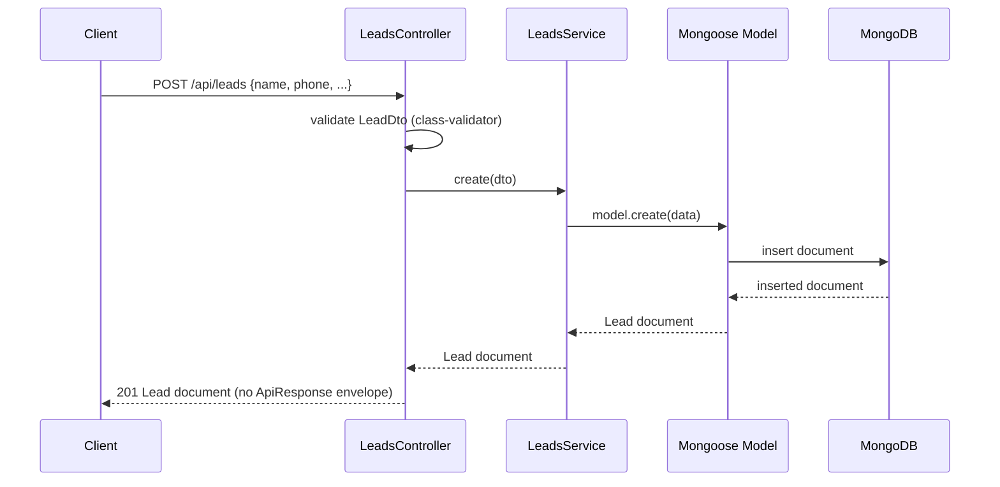

# Backend — Architecture

## Layering

Standard NestJS module/controller/service/schema layering, one module per domain:

```
Controller (HTTP layer, DTO validation via class-validator)
    ↓
Service (business logic, Mongoose model access)
    ↓
Mongoose Schema/Model (persistence)
```

- **Controllers** (`*.controller.ts`) define routes, decorated with both `class-validator` (via the DTOs
  they accept) and `@nestjs/swagger` decorators (`@ApiTags`, `@ApiBearerAuth`, `@ApiOperation`,
  `@ApiResponse`, `@ApiQuery`/`@ApiParam` for query/path params).
- **DTOs** live in a `dto/` subfolder per module (e.g. `backend/src/modules/leads/dto/create-lead.dto.ts`),
  one class per file, formatted normally (one field per line) — **not** the single-dense-line style used
  elsewhere in this codebase. This is a deliberate exception: `@ApiProperty()`/`@ApiPropertyOptional()`
  decorators on every field make the dense style unreadable. Every request DTO field carries both its
  `class-validator` decorator(s) and its `@ApiProperty`; every endpoint has a matching **response** DTO class
  (e.g. `LeadResponseDto`, `LeadListResponseDto`) used purely for Swagger's `type:` option — the controller
  still returns the raw Mongoose document/plain object at runtime, so the response DTO documents the intended
  contract rather than enforcing it (see "No response envelope in use" below). **Standing rule (see project
  memory `feedback_swagger_docs`): every new DTO and endpoint must ship fully Swagger-documented in the same
  change that adds it.**
- **Services** (`*.service.ts`) hold business logic and are the only layer that touches the Mongoose model
  directly via `@InjectModel`.
- **Schemas** (`*.schema.ts`) use `@nestjs/mongoose` decorators (`@Schema`, `@Prop`) and export both the
  Mongoose schema and a `HydratedDocument` type alias (e.g. `UserDocument`, `LeadDocument`).
- **Modules** (`*.module.ts`) wire `MongooseModule.forFeature(...)`, controllers, providers, and any
  cross-module imports (e.g. `AuthModule` imports `UsersModule` to reuse `UsersService`).

## Cross-cutting setup (`backend/src/main.ts`)

- Global route prefix: `api` (`app.setGlobalPrefix('api')`)
- CORS: open (`origin: true, credentials: true`) — no allow-list
- Global `ValidationPipe` with `whitelist: true, transform: true` — unknown DTO fields are stripped, payloads
  are transformed to DTO instances
- Swagger UI generated at `/docs` (raw JSON at `/docs-json`), with Bearer auth configured in the
  `DocumentBuilder` (`addBearerAuth()`, default scheme name `bearer`, matched by every controller's
  `@ApiBearerAuth()`). **All 10 endpoints are fully documented** as of 2026-08-08: tags, operation summaries,
  request DTOs, response DTOs (including error-status descriptions), and security requirements. Public
  routes (`auth.register`/`auth.login`) correctly show no security requirement in the generated spec.

## Data flow (example: creating a lead)



## Notable decisions & gaps (inferred from code, not documented elsewhere)

- **Auth + authorization are three chained global guards.** `AuthModule` registers `JwtAuthGuard`,
  `RolesGuard`, and (2026-08-08) `PermissionsGuard` as `APP_GUARD` providers, in that exact order
  (`backend/src/modules/auth/auth.module.ts`) — order matters, since `PermissionsGuard` reads `request.user`,
  which `JwtAuthGuard` attaches. Every route requires a valid Bearer JWT by default (`JwtAuthGuard`), opt-out
  via `@Public()` (used today only by `auth.register`/`auth.login`), **and** a specific `(Resource, action)`
  grant (`PermissionsGuard` + `@RequirePermission()`, dynamic and SUPERADMIN-configurable via
  `GET/PATCH /api/permissions` — see `.ai/BE/features/permissions.md`). `RolesGuard`/`@Roles()` are kept but
  superseded — applied to zero routes, not the real authorization mechanism. `JwtAuthGuard` doesn't use
  Passport (`@nestjs/passport`/`passport-jwt`) — it's a hand-written guard using the existing `JwtService`
  directly, to avoid adding a new dependency for a single-strategy use case.
- **`register` creates a `CUSTOMER` user, not `ADMIN`.** `AuthService.register` hardcodes `role: 'CUSTOMER'`
  (`backend/src/modules/auth/auth.service.ts`) — changed 2026-08-08 from an earlier `ADMIN` default, which
  was an open privilege-escalation gap (anyone could self-register as an administrator). Staff accounts
  (`ADMIN`, `SALES`, etc.) only exist via `UsersService`'s startup seeder.
- **No response envelope in use.** `common/contracts/index.ts` defines `ApiResponse<T>` /
  `ApiError` shapes, but controllers return raw Mongoose documents or plain objects (e.g.
  `LeadsController.list` returns `{ data, meta }` matching the shape by convention, but `create`/`status`
  return a bare document) — the contract is aspirational, not enforced by any interceptor or base class.
- **Single fixed organization.** `organizationId` defaults to `'default'` (or `DEFAULT_ORGANIZATION_ID`) at
  the schema level and is hardcoded in `LeadsController.list('default', ...)` rather than being derived from
  an authenticated request — consistent with this being a single-org system, not multi-tenant scaffolding.
- **Idempotent startup seeding.** `UsersService.onModuleInit` (`backend/src/modules/users/users.service.ts`)
  seeds 7 fixed role accounts on every boot unless `SEED_USERS=false`, skipping any email that already
  exists. This doubles as the only way non-admin role accounts get created — there's no admin UI/endpoint to
  create users of other roles. `PermissionsService.onModuleInit` (2026-08-08) follows the identical pattern
  for the default permission matrix, gated by `SEED_PERMISSIONS` — see `.ai/BE/features/permissions.md`.
- **DTOs live in a `dto/` subfolder per module** (e.g. `backend/src/modules/leads/dto/create-lead.dto.ts`),
  **not** in the controller file — this note was stale as of a Swagger-documentation pass; see the "DTOs"
  bullet further up this file for the current, correct convention (one class per file, normal multi-line
  formatting, full `@ApiProperty()` coverage).
