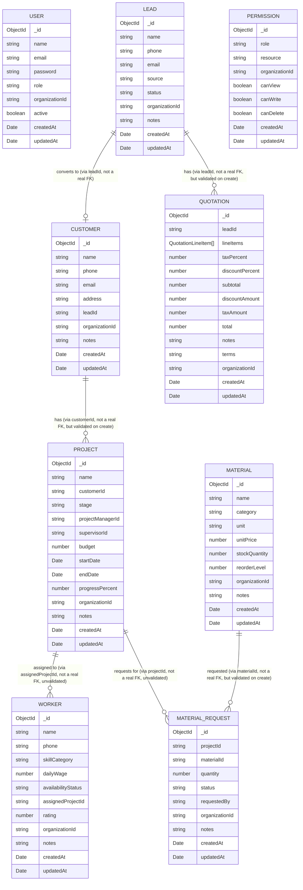

# Backend — Data model

Nine Mongoose collections exist today: `User`, `Lead`, `Customer`, `Project`, `Quotation`, `Worker`,
`Material`, `MaterialRequest`, and `Permission`. All are single-organization records (see `.ai/PROJECT.md`),
not tenant-scoped.

## Entities

### User (`backend/src/modules/users/user.schema.ts`)

| Field | Type | Notes |
|---|---|---|
| `_id` | ObjectId | Mongoose default |
| `name` | string | required |
| `email` | string | required, unique, stored lowercase |
| `password` | string | required, bcrypt hash (cost 12). Excluded via `.select('-password')` from both `GET /api/users` and `GET /api/users/:id` (added 2026-08-10, `.ai/BE/features/user-accounts.md`) — never leaves the service layer over HTTP |
| `role` | string | required, default `'CUSTOMER'`; expected values are the `Role` enum in `common/contracts/index.ts`, but the schema field is a plain `String`, not enum-constrained |
| `organizationId` | string | required, default `'default'` |
| `active` | boolean | default `true`; not currently read or updated anywhere after creation |
| `createdAt` / `updatedAt` | Date | from `{ timestamps: true }` |

### Lead (`backend/src/modules/leads/lead.schema.ts`)

| Field | Type | Notes |
|---|---|---|
| `_id` | ObjectId | Mongoose default |
| `name` | string | required |
| `phone` | string | required |
| `email` | string | optional |
| `source` | string | optional |
| `status` | string | default `'NEW'`; expected values are the `LeadStatus` enum in `common/contracts/index.ts`, but not enum-constrained at the schema or DTO layer |
| `organizationId` | string | default `'default'` |
| `notes` | string | optional |
| `createdAt` / `updatedAt` | Date | from `{ timestamps: true }` |

### Customer (`backend/src/modules/customers/customer.schema.ts`)

| Field | Type | Notes |
|---|---|---|
| `_id` | ObjectId | Mongoose default |
| `name` | string | required |
| `phone` | string | required |
| `email` | string | optional |
| `address` | string | optional, free text (not a structured object) |
| `leadId` | string | optional; `Lead._id` this customer was converted from, if any. Plain string field, not a Mongoose `ref` — no `.populate()` support |
| `organizationId` | string | default `'default'` |
| `notes` | string | optional |
| `createdAt` / `updatedAt` | Date | from `{ timestamps: true }` |

### Project (`backend/src/modules/projects/project.schema.ts`)

| Field | Type | Notes |
|---|---|---|
| `_id` | ObjectId | Mongoose default |
| `name` | string | required |
| `customerId` | string | required; `Customer._id` this project belongs to. Validated to exist at create time by `ProjectsService` (via `CustomersService.findById`), but stored as a plain string, not a Mongoose `ref` |
| `stage` | string | default `'PLANNING'`; expected values are the `ProjectStage` enum in `common/contracts/index.ts`, not enum-constrained at the schema or DTO layer (same gap as `Lead.status`) |
| `projectManagerId` | string | optional; intended `User._id` of the assigned Project Manager. **Not validated** to exist or to have the `PROJECT_MANAGER` role |
| `supervisorId` | string | optional; intended `User._id` of the assigned Site Supervisor. **Not validated** to exist or to have the `SUPERVISOR` role |
| `budget` | number | optional; bare amount, no currency field |
| `startDate` | Date | optional |
| `endDate` | Date | optional |
| `progressPercent` | number | optional; bounded 0–100 at both the Mongoose (`min`/`max`) and DTO (`@Min`/`@Max`) layers |
| `organizationId` | string | default `'default'` |
| `notes` | string | optional |
| `createdAt` / `updatedAt` | Date | from `{ timestamps: true }` |

### Quotation (`backend/src/modules/quotations/quotation.schema.ts`)

| Field | Type | Notes |
|---|---|---|
| `_id` | ObjectId | Mongoose default |
| `leadId` | string | required; `Lead._id` this quotation is issued for. Validated to exist at create time by `QuotationsService` (via `LeadsService.findById`), stored as a plain string, not a Mongoose `ref` |
| `lineItems` | `QuotationLineItem[]` | embedded subdocuments (`{ _id: false }` — no independent line-item ids); each has `description` (string), `category` (`'MATERIAL'\|'LABOR'`), `quantity` (number), `unitPrice` (number), `amount` (number, = `quantity × unitPrice`, computed server-side) |
| `taxPercent` | number | default `0` |
| `discountPercent` | number | default `0` |
| `subtotal` | number | default `0`; computed server-side, sum of `lineItems[].amount` |
| `discountAmount` | number | default `0`; computed server-side, `subtotal × discountPercent / 100` |
| `taxAmount` | number | default `0`; computed server-side, `(subtotal − discountAmount) × taxPercent / 100` — tax is applied **after** discount |
| `total` | number | default `0`; computed server-side, `subtotal − discountAmount + taxAmount` |
| `notes` | string | optional |
| `terms` | string | optional |
| `organizationId` | string | default `'default'` |
| `createdAt` / `updatedAt` | Date | from `{ timestamps: true }` |

### Worker (`backend/src/modules/workers/worker.schema.ts`)

| Field | Type | Notes |
|---|---|---|
| `_id` | ObjectId | Mongoose default |
| `name` | string | required |
| `phone` | string | required |
| `skillCategory` | string | required; validated at the DTO layer against `WORKER_SKILL_CATEGORIES` (`MASON`, `ELECTRICIAN`, `PLUMBER`, `CARPENTER`, `PAINTER`, `MARBLE_WORKER`, `WELDER`) — **strictly** enforced (unlike `Lead.status`/`Project.stage`), but not enum-constrained at the Mongoose schema level either |
| `dailyWage` | number | optional; bare amount, no currency field |
| `availabilityStatus` | string | default `'AVAILABLE'`; validated at the DTO layer against `WORKER_AVAILABILITY_STATUSES` (`AVAILABLE`, `ASSIGNED`, `ON_LEAVE`, `INACTIVE`) — invented for this module, not PRD-specified |
| `assignedProjectId` | string | optional; intended `Project._id` currently assigned to. **Not validated** to exist |
| `rating` | number | optional; bounded 1–5 at both the Mongoose (`min`/`max`) and DTO (`@Min`/`@Max`) layers |
| `organizationId` | string | default `'default'` |
| `notes` | string | optional |
| `createdAt` / `updatedAt` | Date | from `{ timestamps: true }` |

### Material (`backend/src/modules/materials/material.schema.ts`)

| Field | Type | Notes |
|---|---|---|
| `_id` | ObjectId | Mongoose default |
| `name` | string | required |
| `category` | string | required; validated at the DTO layer against `MATERIAL_CATEGORIES` (`CEMENT`, `SAND`, `STEEL`, `BRICKS`, `MARBLE`, `TILES`, `PAINT`, `OTHER`) — invented for this module, not PRD-specified. Not enum-constrained at the Mongoose schema level (same gap as `Worker.skillCategory`) |
| `unit` | string | required, free text (`"bag"`, `"kg"`, `"ton"`, `"sq ft"`) — not constrained, units vary too widely by category |
| `unitPrice` | number | default `0`; bare amount, no currency field |
| `stockQuantity` | number | default `0`; current stock on hand, company-wide (not per-project — a user-directed design decision, see `.ai/BE/features/material-inventory-management.md`) |
| `reorderLevel` | number | default `0`; stock at or below this level surfaces via `GET /materials/low-stock` |
| `organizationId` | string | default `'default'` |
| `notes` | string | optional |
| `createdAt` / `updatedAt` | Date | from `{ timestamps: true }` |

### MaterialRequest (`backend/src/modules/materials/material-request.schema.ts`)

| Field | Type | Notes |
|---|---|---|
| `_id` | ObjectId | Mongoose default |
| `projectId` | string | required; intended `Project._id` this material is requested for. **Not validated** to exist — matches `Worker.assignedProjectId`'s gap |
| `materialId` | string | required; `Material._id` requested. Validated to exist at create time by `MaterialRequestsService` (`404` if not), stored as a plain string, not a Mongoose `ref` |
| `quantity` | number | required, `min: 0` |
| `status` | string | default `'REQUESTED'`; validated at the DTO/service layer against `MATERIAL_REQUEST_STATUSES` (`REQUESTED`, `APPROVED`, `FULFILLED`, `REJECTED`) via named service methods (`approve()`/`reject()`/`fulfill()`), each with its own transition guard — not enum-constrained at the Mongoose schema level (same gap as `Lead.status`) |
| `requestedBy` | string | optional; intended `User._id` of the requester. **Not validated** — no `GET /users` endpoint exists yet |
| `organizationId` | string | default `'default'` |
| `notes` | string | optional |
| `createdAt` / `updatedAt` | Date | from `{ timestamps: true }` |

Fulfilling a request (`PATCH /material-requests/:id/fulfill`) atomically decrements the referenced
`Material.stockQuantity` via a single conditional `findOneAndUpdate` — see
`.ai/BE/features/material-inventory-management.md` for why that matters under concurrent fulfillments.

### Permission (`backend/src/modules/permissions/permission.schema.ts`)

| Field | Type | Notes |
|---|---|---|
| `_id` | ObjectId | Mongoose default |
| `role` | string | required, **Mongoose-`enum`-constrained** to `Role` — unlike every other schema's `role`/status-like field in this app (`User.role`, `Lead.status`, `Project.stage`, `Worker.skillCategory`/`availabilityStatus`, `Material.category`, `MaterialRequest.status`), which are intentionally open strings. A typo'd role here would silently create a dead, unreachable row, so this one schema was given the stricter treatment — see the Open questions note below. |
| `resource` | string | required, **Mongoose-`enum`-constrained** to `Resource` (`common/contracts/index.ts`: `LEADS, CUSTOMERS, PROJECTS, QUOTATIONS, WORKERS, MATERIALS, PERMISSIONS`) |
| `organizationId` | string | required, default `'default'` |
| `canView` | boolean | default `false` |
| `canWrite` | boolean | default `false` |
| `canDelete` | boolean | default `false` — no route in the app currently exercises this (no delete endpoints exist anywhere yet) |
| `createdAt` / `updatedAt` | Date | from `{ timestamps: true }` |

Unique compound index on `{ role, resource, organizationId }` — prevents duplicate rows and doubles as the
lookup index `PermissionsService.check()` hits on every protected request. See
`.ai/BE/features/permissions.md`.

## Relationships

- `Customer.leadId` optionally references `Lead._id` (see `.ai/BE/features/customer-management.md`), set
  when a customer is created via `POST /api/leads/:id/convert`.
- `Project.customerId` **required**-references `Customer._id` (see `.ai/BE/features/project-management.md`),
  validated to exist at create time.
- `Quotation.leadId` **required**-references `Lead._id` (see `.ai/BE/features/quotation-management.md`),
  also validated to exist at create time.
- `Project.projectManagerId` / `Project.supervisorId` / `Worker.assignedProjectId` are intended references to
  `User._id`/`Project._id` respectively, all unvalidated.
- All of the above are stored as plain strings, not Mongoose `ref`/`ObjectId` relations, so there's no
  `.populate()` support anywhere — callers needing related-entity details must fetch them separately by id.
- `User` isn't referenced by any collection with an enforced check. All six collections are linked implicitly
  via the shared `organizationId` constant.
- `Quotation` references `Lead` directly, not `Customer`/`Project` — a quotation is issued during the lead
  pipeline (before conversion), so there is currently no path from a `Project` to its originating
  quotation(s) other than via the shared `Lead`.
- `Worker` has no required foreign key at all — it's linked to a project only via the optional, unvalidated
  `assignedProjectId`.
- `MaterialRequest.materialId` **required**-references `Material._id` (see
  `.ai/BE/features/material-inventory-management.md`), validated to exist at create time.
  `MaterialRequest.projectId` is an intended `Project._id` reference, unvalidated (same gap as
  `Worker.assignedProjectId`).
- `Permission` doesn't reference any document — `role`/`resource` are both closed enum values, not foreign
  keys to another collection's `_id`. It's the one collection in this app that isn't "about" a business
  record; it's configuration read by `PermissionsGuard` on every protected request. See
  `.ai/BE/features/permissions.md`.

## Indexes

- `User.email` — unique index (`@Prop({ required: true, unique: true, lowercase: true })`).
- `Permission` — unique compound index on `{ role, resource, organizationId }`, the only other explicit
  index in the app. Doubles as the exact shape of the guard's hot-path lookup query.
- No other explicit indexes are declared on any schema. `Lead`, `Customer`, `Project`, `Quotation`,
  `Worker`, `Material`, and `MaterialRequest` queries filter/sort by `organizationId` and `createdAt`
  (`list()` in each service) without a compound index defined for that access pattern. Existence-check
  queries (`Customer.findByLeadId`, `ProjectsService.create()`'s customer lookup,
  `QuotationsService.create()`'s lead lookup, `MaterialRequestsService.create()`'s material lookup) are all
  unindexed beyond Mongo's default `_id` index. `MaterialsService.lowStock()`'s `$expr` comparison
  (`stockQuantity <= reorderLevel`) is also unindexed — fine at catalog-sized scale, would need a different
  approach (e.g. a maintained boolean flag) if the catalog grows large.

## ER diagram

`PERMISSION` is deliberately not connected to any other entity above — it's keyed by the `Role`/`Resource`
enum values themselves, not by a document reference, so there's no meaningful FK-style relationship to draw.

No relationship is modeled between `USER` and any other collection in the current schema (see Open
questions) — `Project.projectManagerId`/`supervisorId` are intended `User` references but unvalidated.

## Planned entities (not yet implemented)

Per `.ai/PRODUCT_SPEC.md`, these entities are implied by planned modules but have **no schema, no code** —
listed here only so the eventual data model isn't designed from scratch, not as a commitment to exact field
names/types. See each module's feature file for the source module and open design questions.

| Entity | Planned module | Feature doc |
|---|---|---|
| `Supplier` | Module 8 | `.ai/BE/features/supplier-management.md` |
| `Expense` | Module 9 | `.ai/BE/features/expense-management.md` |
| `Invoice` / `Payment` | Module 10 | `.ai/BE/features/billing-payments.md` |
| `SiteReport` | Module 11 | `.ai/BE/features/daily-site-reports.md` |

None of these appear in the ER diagram above — that diagram reflects only what's actually implemented.

## Open questions

- Should `Lead` have an owning/assigned `User` reference? No such field exists today, so leads cannot be
  attributed to a sales rep in the data model. **Status: still undecided** — confirmed as unresolved on
  2026-08-08.
- Should `role` and `status` be constrained to their respective enums at the Mongoose schema level
  (`enum: Object.values(Role)`) rather than being open strings? **Status: still undecided for the existing
  schemas** — confirmed as unresolved on 2026-08-08. Note: `Permission.role`/`resource` (added 2026-08-08)
  *are* enum-constrained, the first schema in the app to be — see that entity's notes above for why the
  stakes were judged different there. This doesn't resolve the question for `User.role`/`Lead.status`/
  `Project.stage`/etc., just establishes that the pattern is available and already used once.
