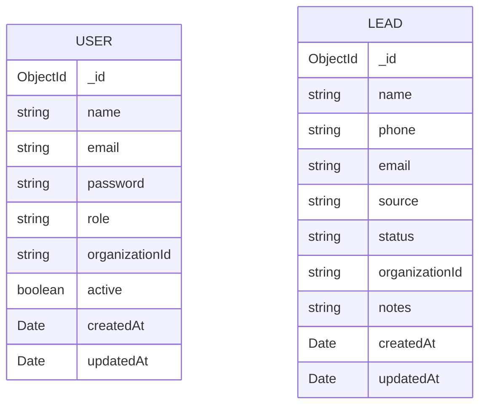

# Backend — Data model

Two Mongoose collections exist today: `User` and `Lead`. Both are single-organization records (see
`.ai/PROJECT.md`), not tenant-scoped.

## Entities

### User (`backend/src/modules/users/user.schema.ts`)

| Field | Type | Notes |
|---|---|---|
| `_id` | ObjectId | Mongoose default |
| `name` | string | required |
| `email` | string | required, unique, stored lowercase |
| `password` | string | required, bcrypt hash (cost 12) |
| `role` | string | required, default `'CUSTOMER'`; expected values are the `Role` enum in `common/contracts/index.ts`, but the schema field is a plain `String`, not enum-constrained |
| `organizationId` | string | required, default `'default'` |
| `active` | boolean | default `true`; not currently read or updated anywhere after creation |
| `createdAt` / `updatedAt` | Date | from `{ timestamps: true }` |

### Lead (`backend/src/modules/leads/lead.schema.ts`)

| Field | Type | Notes |
|---|---|---|
| `_id` | ObjectId | Mongoose default |
| `name` | string | required |
| `phone` | string | required |
| `email` | string | optional |
| `source` | string | optional |
| `status` | string | default `'NEW'`; expected values are the `LeadStatus` enum in `common/contracts/index.ts`, but not enum-constrained at the schema or DTO layer |
| `organizationId` | string | default `'default'` |
| `notes` | string | optional |
| `createdAt` / `updatedAt` | Date | from `{ timestamps: true }` |

## Relationships

No explicit foreign-key/ref relationships exist between `User` and `Lead` in the schema (no `assignedTo` or
`ownerId` field on `Lead`). Both collections are linked only implicitly via the shared `organizationId`
constant.

## Indexes

- `User.email` — unique index (`@Prop({ required: true, unique: true, lowercase: true })`).
- No other explicit indexes are declared on either schema. `Lead` queries filter/sort by `organizationId` and
  `createdAt` (`leads.service.ts` `list()`) without a compound index defined for that access pattern.

## ER diagram

No direct relationship is modeled between `USER` and `LEAD` in the current schema (see Open questions).

## Planned entities (not yet implemented)

Per `.ai/PRODUCT_SPEC.md`, these entities are implied by planned modules but have **no schema, no code** —
listed here only so the eventual data model isn't designed from scratch, not as a commitment to exact field
names/types. See each module's feature file for the source module and open design questions.

| Entity | Planned module | Feature doc |
|---|---|---|
| `Customer` | Module 3 | `.ai/BE/features/customer-management.md` |
| `Project` | Module 4 | `.ai/BE/features/project-management.md` |
| `Quotation` | Module 5 | `.ai/BE/features/quotation-management.md` |
| `Worker` | Module 6 | `.ai/BE/features/worker-management.md` |
| `Material` | Module 7 | `.ai/BE/features/material-inventory-management.md` |
| `Supplier` | Module 8 | `.ai/BE/features/supplier-management.md` |
| `Expense` | Module 9 | `.ai/BE/features/expense-management.md` |
| `Invoice` / `Payment` | Module 10 | `.ai/BE/features/billing-payments.md` |
| `SiteReport` | Module 11 | `.ai/BE/features/daily-site-reports.md` |

None of these appear in the ER diagram above — that diagram reflects only what's actually implemented.

## Open questions

- Should `Lead` have an owning/assigned `User` reference? No such field exists today, so leads cannot be
  attributed to a sales rep in the data model. **Status: still undecided** — confirmed as unresolved on
  2026-08-08.
- Should `role` and `status` be constrained to their respective enums at the Mongoose schema level
  (`enum: Object.values(Role)`) rather than being open strings? **Status: still undecided** — confirmed as
  unresolved on 2026-08-08.
