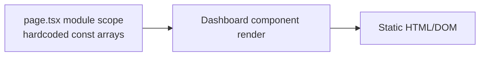

# Frontend — Architecture

## Current state

The frontend is a **single static page** — there is no architecture to speak of yet beyond Next.js App
Router defaults:

```
src/app/layout.tsx   → renders <html><body>{children}</body></html>, imports styles.css globally
src/app/page.tsx      → the entire UI: a React Server/Client Component tree with hardcoded arrays
                          (metrics, pipeline, activity items, a projects table) rendered inline
```

`page.tsx` is not marked `'use client'`, so it renders as a React Server Component by default — but since it
has no data fetching, no interactivity, and no event handlers, this distinction currently has no practical
effect. All content — metric values, pipeline counts, activity feed entries, project rows, even the
greeting name "Arjun" and the date string "FRIDAY, 07 AUGUST 2026" — is hardcoded directly in the component
(`frontend/src/app/page.tsx`).

## Data flow



There is no fetch, no API client, no environment-variable usage (`NEXT_PUBLIC_API_URL` is declared in
`.env.example` but not referenced anywhere in `src/`), and no client-side state (no `useState`/`useEffect`/
routing hooks). Buttons and nav links in the markup (`＋ New lead`, sidebar items like `Leads`, `Projects`,
etc.) render as static elements with no `href`/`onClick` handlers — they are visual only.

## Patterns and conventions actually in use

- **Styling:** one global stylesheet (`src/app/styles.css`), plain CSS with hand-rolled class names (`.shell`,
  `.metric`, `.pipeline`, `.pill.green`, etc.) — no CSS Modules, no Tailwind, no styled-components.
- **Component structure:** a single default-exported page component (`Dashboard`) plus one small local helper
  component (`Activity`) defined in the same file — no shared `components/` directory exists yet.
- **No abstraction layer for data** — values live as module-level `const` arrays at the top of `page.tsx`.

## Trade-offs / observations

- Because there's no API integration, the dashboard cannot reflect real leads/projects data from the backend
  — every number shown is fabricated for visual/demo purposes.
- The sidebar advertises sections (Leads, Customers, Projects, Quotations, Workers, Materials, Finance) that
  have neither frontend routes nor (for most) backend modules — see `.ai/PROJECT.md` Open questions.
- Since there's no client-side auth state, there is also no login screen or session handling on the frontend
  — a user reaching `/` sees the dashboard unconditionally.

## Open questions

None outstanding. Confirmed 2026-08-08: the hardcoded data is a placeholder awaiting real API integration
(not a permanent mockup, and no separate WIP effort exists elsewhere) — see
`.ai/FE/features/dashboard-shell.md` and `.ai/PROJECT.md` Roadmap decisions. Backend auth guards are the
confirmed next priority ahead of this wiring work.
